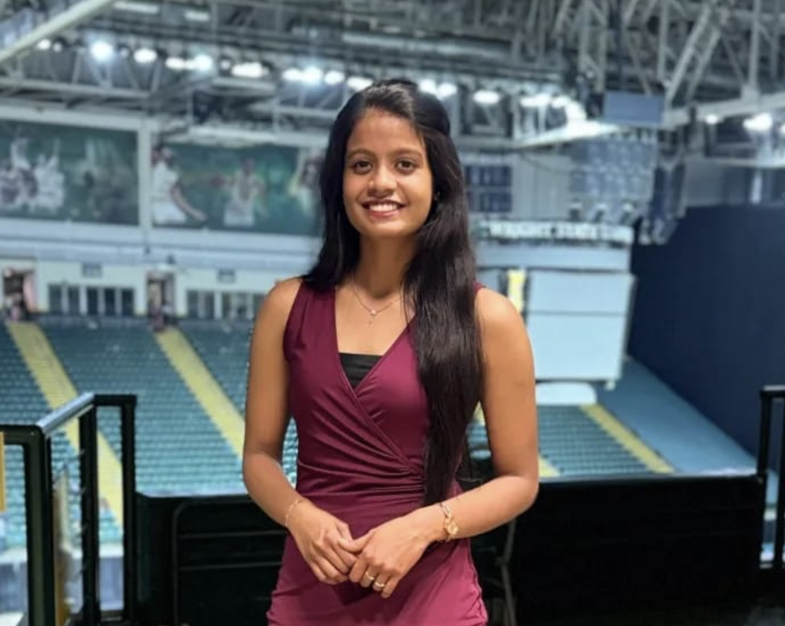

---
hide:
    - navigation
    - toc
    - headings
---

<!--  -->
<figure markdown="span">
  { width="400" }
</figure>

<h2>
I am a passionate software engineer with a strong foundation in <b>full-stack web development and a knack for problem-solving</b>. My journey in software engineering began with a fascination for creating elegant solutions to complex problems, and since then, I have honed my skills through hands-on experience and continuous learning.
</h2>
<h2>
I have a <b>Master of Science in Computer Science from Wright State University, Dayton, OH, USA	and I am open to work in the United States</b>. I am looking for a role where I can leverage my skills in full-stack web development to create innovative solutions that drive business growth and enhance user experience. I am excited to work with a team of talented professionals who share my passion for technology and innovation. 
</h2>

## Contact

- [:envelope: shereenjubal1@gmail.com](mailto:shereenjubal1@gmail.com)
- [:fontawesome-brands-linkedin: ./shereen-jubal](https://www.linkedin.com/in/shereen-jubal/)

[Checkout my CV](#){ .md-button .md-button--primary }